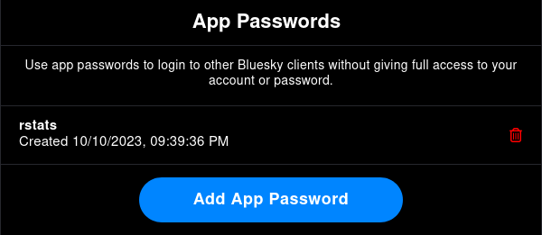

# Summary

The AT Protocol behind the social network site Bluesky is an open protocol licensed under a Dual MIT/Apache-2.0 License.

Two different reasons motivated the creation of this package. 
1. First, as the social network platform Bluesky grows, the interest for digital traces from Bluesky also grows. `atrrr` provides R-users a simple solution to collect data on Bluesky. 
2. Second, the Authenticated Transfer Protocol (atproto) has the ambition of becoming the backbone for any social media platform. This suggest that, in a near future, `atrrr` will not only be useful for users interested in Bluesky but also to the community of users interested in any platform based on atproto. 

# Statement of need

The goal of `atrrr` is to provide a direct access from R to the data endpoint offered by the Authenticated Transfer Protocol and the platform Bluesky. 

The structure of development for the R package `atrrr` aims at reducing the maintenance costs without sacrificing the usability of the function. It hence provides stable and high-level functions, which use a coherence syntax. These functions are meant to be (1) simple to learn, (2) flexible and (3) stable across time. 

The high-level functions rely on automated generated lower-level functions that automatically wrap the detailed endpoint offered by atproto and more specifically the bluesky platform. This appraoch provides us with a very simple maintenance cycle. Once an update is pushed to the atproto/bluesky, we simply (1) automatically regenerate the lower-level functions and (2) adapt, where necessary, the internal behavior of the higher-level functions to eventual changes. 

As researcher, we primarily developed `atrrr` for research purpose. We explicitly attempted to make `atrrr` user-friendly to allow as many researchers as possible from various disciplines and at various levels to use `atrrr`. This being said and despite our primary focus on research, the package is well-suited for non-research use-cases.

Admittedly, one last motivation to develop this package was the process of data rarefaction that affects researchers working on social media platforms. Both `rtweet` [@rtweet-package] and `academictwitteR` [@academictwitteR] became depecrated and there is no efficient and cheap ways anymore to gather data on Twitter. This threatens many academic projects and calls for the swift replacement of those data sources with open-sourced ones which cannot be suddenly and discretionary shutdown. We acknolwedge that Bluesky has not (yet) replaced Twitter, but we see potential in the atproto to host future social media platform. Accordingly, beyond the immediate benefits of having access to bluesky data, `atrrr` is a bet on the future adoption of atproto as the standard backend for social media platofrms. 

# Background: atproto

The self-stated goal of Bluesky PBC is to develop the Authenticated Transfer Protocol (atproto) into an open "protocol for public conversation and an open-source framework for building social apps, meaning people have transparency into how it is built and what is being developed" [@blueskyweb].
Specifically, this means that they are creating a standard format for user identity, social graphs, and authored documents which can be used by any actor willing to build a social media-like platform.
Even in the seemingly unlikely event of a (billionaire) takeover or otherwise triggered "enshittification" [@doctorowEnshittification] of Bluesky, users should in the future be able to move their identiy, network and documents to alternative platforms with minimal friction [@blueskyweb]. This shall increase the competition between platforms and empower users. Once the transition to other platforms is cheap, the threat of being hold accountable for bad decisions should make platforms more responsive to the needs and wills of their users.

# Auto-generated implementation

Lexicon constitute a core-concept of the atproto ecosystem. A lexicon is a JSON-formatted template that defines a specific object - user, post or social link - and is used to automatically generate API endpoints.

Because they are use to automatically generate API endpoints, lexicon can be used to automatically write wrappers allowing users to query the endpoint. These endpoints allow, from any other language, both reading data stored with the atproto and interacting with services hosted on the atproto. A number of projects in Python, Go, Rust etc. already exist (see <https://atproto.com/community/projects>).

For the R langguage, we decided to automatically wrap the entire set of lexicons --- 105 at the time of writing. For the sake of simplicity, these lower-level functions are not exported \footnote{they are hence invisible to the users and can only be accessed using the operator `:::`, such as in `atrrr:::com_*` and `atrrr:::app_*`}. Instead, they are called internally by higher-level and user-facing functions that are meant to provide stability to users.

This automatic development shall also ease the collaboration with further developers. It requires minimal maintenance effort, which hence reduces the collaboration frictions. 

Below, we show an example of a user-facing function that uses the internal `app_bsky_actor_get_profiles` to query information about a specific user profile.

```
get_user_info <- function(actor,
                          parse = TRUE,
                          .token = NULL) {

  # we need to use do.call so objects are passed to the right environment
  res <- do.call( 
    what = app_bsky_actor_get_profiles,
    args = list(
      actor,
      .token = .token, # tokens are handled automatically under the hood
      .return = "json"
    )) |>
    purrr::pluck("profiles")

  if (parse) {
    res <- parse_actors(res)
  }
  return(res)
}
```

# Usage

The package can be installed from CRAN (the Comprehensive R Archive Network):

```r
install.packages("atrrr")
```

or from GitHub using remotes [@remotes]:

``` r
# install.packages("remotes")
remotes::install_github("JBGruber/atrrr")
```

After that, the user should authenticate with their username.

``` r
library(atrrr)
auth("jbgruber.bsky.social")
```

This will open a browser and navigate to <https://bsky.app/settings/app-passwords>, where users can create an app password, as seen in \autoref{fig:pw}.
With this password, every user has unlimited access to the endpoints connecting to Bluesky free of charge and without special requirement for research access.
Users are asked to enter the password in a secure pop-up window and the resulting token is stored in an encryted file in the user's cache directory.
As long as the password is not revoked, the user will not have to repeat this step.
If no token is stored in the cache, the `auth` function is triggered automatically.



We maintain a number of analysis examples at <https://jbgruber.github.io/atrrr/articles/>.
To highlight just ...

- `atrrr::search_post()`
- https://jbgruber.github.io/atrrr/articles/Networks.html#follower-network-visualization
- `post_skeet(text = "This post was made with the #rstats package {atrrr}", image = "https://jbgruber.github.io/atrrr/logo.png", image_alt = "The atrrr hex logo showing clouds and network edges in front of a blue sky")`

# References
