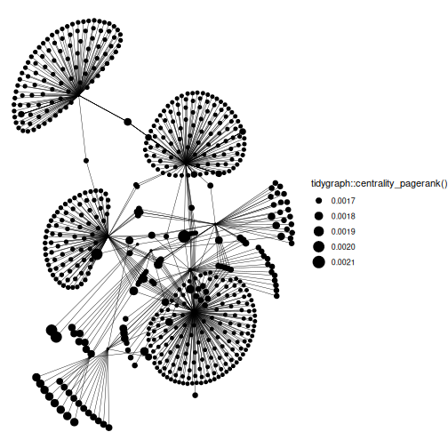
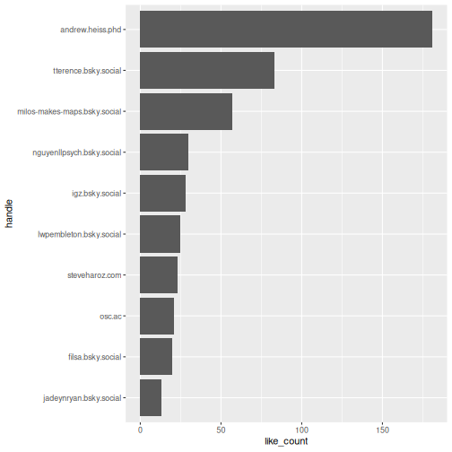

# Introduction


Welcome to the `atr` vignette! This guide will delve deeper into the functionalities offered by the package-

Before diving in, let's clarify some terminology. In the context of Blue Sky, a post is referred to as a "skeet." So, when we mention retrieving or working with "skeets," we are talking about individual posts made on Blue Sky.

Now, let's delve deeper into the functionalities that allow users to interact with skeets, followers, and their descriptions.

## Installation

If you haven't done so, you can install the development version of atr like so (`pak` works similar to `remotes` here, but it's what the cool kids use now :grin:):

``` r
# install.packages("pak")
pak::pak("JBGruber/atr")
```


## Load the package


```r
library(atr)
```

## Authentication

The first time you make a request, you will be prompted automatically to enter your user handle and an app password to authenticate `atr` to communicate with BlueSky for you.


The page to generate app passwords is also automatically opened for you.


However, you can also trigger this process manually:


```r
auth("jbgruber.bsky.social")
```

This can be useful if you want to replace an old token as it is permanently stored encrypted on disk.

# Searching Posts

The AT protocol defines a search function at `app.bsky.feed.searchPosts`, however, it is not currently active, as far as we could tell.

As soon as the functionality is added by BlueSky, we will implement it here.


# Blue Sky Users


## Retrieve user info (`get_user_info`)

A good starting point is understanding a user's digital footprint on the platform. The get_user_info function becomes our handy tool, fetching an array of information about a user. All you need? Their handle!


```r
get_user_info(actor = "atpr.bsky.social")  |>
  dplyr::glimpse()
#> Rows: 1
#> Columns: 8
#> $ did              <chr> "did:plc:j42kj…
#> $ handle           <chr> "atpr.bsky.soc…
#> $ followsCount     <int> 2
#> $ followersCount   <int> 4
#> $ postsCount       <int> 8
#> $ viewer_muted     <lgl> FALSE
#> $ viewer_blockedBy <lgl> FALSE
#> $ viewer_following <chr> "at://did:plc:…
```

This function gives us counts of followers, follows, posts for each user.

You can also retrieve information for multiple users by providing a vector of user handles:


```r
get_user_info(actor = c("benguinaudeau.bsky.social", "atpr.bsky.social"))  |>
  dplyr::glimpse()
#> Rows: 2
#> Columns: 14
#> $ did               <chr> "did:plc:vuvs…
#> $ handle            <chr> "benguinaudea…
#> $ displayName       <chr> "Benjamin Gui…
#> $ description       <chr> "Postdoc @CSM…
#> $ avatar            <chr> "https://cdn.…
#> $ banner            <chr> "https://cdn.…
#> $ followsCount      <int> 134, 2
#> $ followersCount    <int> 330, 4
#> $ postsCount        <int> 18, 8
#> $ indexedAt         <chr> "2023-09-19T0…
#> $ viewer_muted      <lgl> FALSE, FALSE
#> $ viewer_blockedBy  <lgl> FALSE, FALSE
#> $ viewer_following  <chr> "at://did:plc…
#> $ viewer_followedBy <chr> "at://did:plc…
```


## Retrieve Skeets (`get_skeets_authored_by`)

To fetch all the skeets by a specific user, use the `get_skeets_authored_by` function. *Note this also includes quote skeets and reskeets.* You can also opt not to parse the result by setting `parse = FALSE`, however it is recommended to use the default parse option which results in a (more) tidy tibble.


```r
get_skeets_authored_by(actor = "benguinaudeau.bsky.social", parse = TRUE) |>
  dplyr::glimpse()
#> Rows: 24
#> Columns: 11
#> $ uri          <chr> "at://did:plc:l6z5…
#> $ cid          <chr> "bafyreihfmnxonlhl…
#> $ author       <list> ["did:plc:l6z5l7d…
#> $ text         <chr> "I am very much lo…
#> $ record       <list> ["I am very much …
#> $ reply_count  <int> 0, 3, 0, 2, 0, 2, …
#> $ repost_count <int> 2, 45, 0, 12, 0, 0…
#> $ like_count   <int> 8, 38, 2, 36, 1, 5…
#> $ indexed_at   <dttm> 2023-10-05 15:53:…
#> $ reply        <list> <NULL>, <NULL>, […
#> $ is_reskeet   <lgl> TRUE, TRUE, FALSE,…
```

Feeling adventurous? Increase the `limit` and explore more of their content.


```r
get_skeets_authored_by(actor = "favstats.bsky.social", limit = 30) |>
  dplyr::glimpse()
#> Rows: 30
#> Columns: 11
#> $ uri          <chr> "at://did:plc:7ao7…
#> $ cid          <chr> "bafyreih2ave4w472…
#> $ author       <list> ["did:plc:7ao77we…
#> $ text         <chr> "Hallo to all our …
#> $ record       <list> ["Hallo to all ou…
#> $ reply_count  <int> 0, 0, 6, 0, 1, 1, …
#> $ repost_count <int> 1, 3, 25, 0, 0, 0,…
#> $ like_count   <int> 3, 7, 50, 3, 2, 0,…
#> $ indexed_at   <dttm> 2023-10-06 08:28:…
#> $ reply        <list> <NULL>, <NULL>, <…
#> $ is_reskeet   <lgl> TRUE, TRUE, TRUE, …
```


# Exploring Connections: Get Followers and Follows

You can retrieve a list of followers and those followed by a user through the `get_followers` and `get_follows` functions, respectively. This gives a glimpse of their social dynamics on the platform.

## `get_followers`


```r
get_followers(actor = "benguinaudeau.bsky.social", limit = 200)  |>
  dplyr::glimpse()
#> Rows: 204
#> Columns: 11
#> $ did                <chr> "did:plc:wga…
#> $ handle             <chr> "mbayerlein.…
#> $ display_name       <chr> "Michael Bay…
#> $ description        <chr> "PostDoc at …
#> $ avatar             <chr> "https://cdn…
#> $ indexed_at         <chr> "2023-10-11T…
#> $ viewer_muted       <lgl> FALSE, FALSE…
#> $ viewer_blocked_by  <lgl> FALSE, FALSE…
#> $ viewer_following   <chr> "at://did:pl…
#> $ viewer_followed_by <chr> "at://did:pl…
#> $ labels             <named list> <NULL…
```


## `get_follows`


```r
atr:::get_follows(actor = "benguinaudeau.bsky.social", limit = 200)  |>
  dplyr::glimpse()
#> Rows: 152
#> Columns: 11
#> $ did                  <chr> "did:plc:z…
#> $ handle               <chr> "marcdebus…
#> $ display_name         <chr> "Marc Debu…
#> $ description          <chr> "Professor…
#> $ avatar               <chr> "https://c…
#> $ indexed_at           <chr> "2023-10-0…
#> $ viewer_muted         <lgl> FALSE, FAL…
#> $ viewer_blocked_by    <lgl> FALSE, FAL…
#> $ viewer_following     <chr> NA, NA, "a…
#> $ viewer_followed_by   <chr> NA, NA, NA…
#> $ viewer_muted_by_list <named list> <NU…
```

You'll notice each follower/following has a description (i.e. their bio). It's a nifty way to get to know a bit about them at a glance!


## Follower Network Visualization

This section guides you through the process of visualizing a follower network for a given user on Blue Sky. The primary focus is on the "skeets" (posts) and the interconnected relationships among followers.

The first step is to load some additional packages. Then we get the followers for the main user we are interested in. We will then delve deeper and fetch the followers for each of these followers.


```r
library(ggplot2)
library(dplyr)
library(purrr)
library(tidyr)
library(igraph)
library(ggraph)
library(tidygraph)

# Retrieve the followers for the main user
some_followers <- get_followers(actor = "benguinaudeau.bsky.social", limit = 10)$handle

# For each follower, retrieve their own set of followers.
# This provides a nested view of relationships.
followers_of_followers <- some_followers |>
  purrr::map_dfr(~{
    get_followers(actor = .x, limit = 200) |>
    mutate(from = .x)
  }) |>
  dplyr::rename(to = handle) |>
  dplyr::select(from, to)
```


## Building and Visualizing the Follower Network


```r
# Construct the network graph and plot
graph <- igraph::graph_from_data_frame(followers_of_followers, directed = TRUE)

# Use ggraph to visualize the network.
ggraph::ggraph(graph, layout = "kk") +
  ggraph::geom_edge_link(width = 0.2) +
  ggraph::geom_node_point(aes(size = tidygraph::centrality_pagerank())) +
  ggplot2::theme_void()
```

<div class="figure">

<p class="caption">Follower Network</p>
</div>

## Find people to follow

You can use a similar approach to find new people you might want to follow.
First get all the people you already follow by quering your own account:


```r
my_follows <- get_follows(actor = "jbgruber.bsky.social",
                              limit = 10)$handle # limit only for demonstration

# For each account you follow, retrieve who they follow.
follows_of_follows <- my_follows |>
  purrr::map_dfr(~{
    get_followers(actor = .x, limit = 100) |>
      mutate(from = .x)
  })

# Now we can check which accounts are popular among the people you already follow
follows_of_follows |>
  dplyr::filter(!handle %in% my_follows) |> # exclude accounts you already follow
  dplyr::count(display_name, handle, sort = TRUE)
#> # A tibble: 578 × 3
#>    display_name              handle     n
#>    <chr>                     <chr>  <int>
#>  1 "Patrick Zerrer "         pzerr…    14
#>  2 "Rebekah Tromble"         rebek…    14
#>  3 "Fulltime HTML Programme… progr…    10
#>  4 "Johannes B. Gruber"      jbgru…    10
#>  5 "Allison Eden"            aeden…     7
#>  6 "David Rand"              dgran…     7
#>  7 "Erika Franklin Fowler"   efran…     7
#>  8 "Felicia Loecherbach"     feloe…     7
#>  9 "Ross Dahlke"             rossd…     6
#> 10 "Amarjeet choudhary "     amarj…     5
#> # ℹ 568 more rows
```

The original account shows up in this overview, as do accounts that were excluded because of the limit set to do the demonstration.
But all of these accounts look intresting!

# Interacting with Blue Sky: Posts, Replies, and Deletions

In this section, we will cover how to interact with the Blue Sky platform by creating posts (skeets), replying to them, and eventually, if necessary, deleting them.

## Posting a Skeet

Here's how you can easily post a skeet to your account:


```r
post <- post_skeet(text = "Posting around")
```

By running the above command, you've successfully created a skeet with the content "Posting around."


## Replying to a Skeet

Engaging with the Blue Sky community often means replying to existing skeets. Here's how you can craft a reply:


```r
reply <- post_skeet(text = "Replying around", in_reply_to = post$uri)

```

Notice the in_reply_to parameter? This ensures that our reply is linked to the original post, creating a thread of conversation.
If you don't have the URI of a skeet, a link to it will also do.


## Deleting a Skeet

Whether it's to correct an error, remove outdated information, or any other reason, sometimes you might want to delete a skeet. Here's how:


```r
delete_skeet(post_url = reply$uri)
```


##  Crafting Threads in Blue Sky

Threads are a series of connected posts or "skeets" on Blue Sky. They're a great way to communicate longer ideas or stories, where each skeet builds on the previous one. In this section, we'll explore how to create a thread seamlessly.

A thread is essentially a series of individual skeets. Here's how you can do it programmatically using `post_thread`:


```r
post_thread(texts = c("This is the first amazing skeet.",
                      "Now I am expanding upon my skeet!",
                      "Conclusion: I skeet therefore I am."))
```


## Following and Unfollowing Users in Blue Sky

One of the fundamental ways to connect with other users is by following them, allowing you to see their posts in your feed. Conversely, if you decide that you no longer want to see updates from a particular user, you can unfollow them.


```r
# Follow a user by their handle
follow(actor = "benguinaudeau.bsky.social")
```


## Support for posting media

Media can be posted by using a path to a file.
They can also be included in a thread


```r
# make a basic plot
plot <- ggplot(mpg, aes(displ, hwy, colour = class)) +
  geom_point()

# save it to a file
f1 <- ggsave(filename = tempfile(pattern = "1", fileext = ".png"), plot = plot)

# a second basic plot
lty <- c("solid", "dashed", "dotted", "dotdash", "longdash", "twodash")
linetypes <- data.frame(
  y = seq_along(lty),
  lty = lty
)
plot2 <- ggplot(linetypes, aes(0, y)) +
  geom_segment(aes(xend = 5, yend = y, linetype = lty)) +
  scale_linetype_identity() +
  geom_text(aes(label = lty), hjust = 0, nudge_y = 0.2) +
  scale_x_continuous(NULL, breaks = NULL) +
  scale_y_reverse(NULL, breaks = NULL)

# again we save it to a temporary file
f2 <- ggsave(tempfile(pattern = "2", fileext = ".png"), plot = plot2)

# Now we post the pictures in a thread
post_thread(texts = c("This is the first plot on the ggplot2 website",
                      "This is the second plot on the ggplot2 website",
                      "And this is just text sent from the atr package by @jbgruber.bsky.social, @benguinaudeau.bsky.social and @favstats.bsky.social"),
            images = c(f1, f2, ""),
            image_alts = c("first ggplot2 plot",
                           "second ggplot2 plot",
                           ""))
```


# Analyzing Feeds on Blue Sky

On Blue Sky users have the ability to create custom feeds based on specific keywords. These feeds aggregate content, for instance, a user might curate a feed around the hashtag `#rstats` to gather all relevant content about. Let's delve into the dynamics of such user-curated feeds.

## Retrieving a Curated Feed

Our starting point is to extract the posts from a user-curated feed. We're focusing on a feed curated by "andrew.heiss.phd".


```r
# Fetching the feed posts
feeds <- get_feeds_created_by(actor = "andrew.heiss.phd") |>
  dplyr::glimpse()
#> Rows: 4
#> Columns: 19
#> $ uri                      <chr> "at://…
#> $ cid                      <chr> "bafyr…
#> $ did                      <chr> "did:w…
#> $ creator_did              <chr> "did:p…
#> $ creator_handle           <chr> "andre…
#> $ creator_displayName      <chr> "Andre…
#> $ creator_description      <chr> "Assis…
#> $ creator_avatar           <chr> "https…
#> $ creator_indexedAt        <chr> "2023-…
#> $ creator_viewer_muted     <lgl> FALSE,…
#> $ creator_viewer_blockedBy <lgl> FALSE,…
#> $ creator_viewer_following <chr> "at://…
#> $ displayName              <chr> "Publi…
#> $ description              <chr> "A fee…
#> $ avatar                   <chr> "https…
#> $ likeCount                <int> 72, 15…
#> $ indexedAt                <chr> "2023-…
#> $ created_at               <dttm> 2023-…
#> $ viewer_like              <chr> NA, NA…

# Filtering for a specific keyword, for example "#rstats"
rstat_feed <- feeds |>
  filter(displayName == "#rstats")

# Extracting posts from this curated feed
rstat_posts <- get_feed(rstat_feed$uri, limit = 200) |>
  # Extracting user handle from the author
  mutate(handle = author |> map_chr(~{.x$handle}))  |>
  dplyr::glimpse()
#> Rows: 89
#> Columns: 11
#> $ uri          <chr> "at://did:plc:bpwm…
#> $ cid          <chr> "bafyreic7iiamtnin…
#> $ author       <list> ["did:plc:bpwmgq3…
#> $ text         <chr> "Hi Bluesky! I fin…
#> $ record       <list> ["Hi Bluesky! I f…
#> $ reply_count  <int> 0, 1, 1, 0, 0, 1, …
#> $ repost_count <int> 1, 1, 1, 2, 0, 0, …
#> $ like_count   <int> 6, 6, 8, 5, 1, 1, …
#> $ indexed_at   <dttm> 2023-10-11 06:18:…
#> $ reply        <list> <NULL>, <NULL>, <…
#> $ handle       <chr> "fdechterenko.bsky…
```


## Identifying Top Contributors

Who are the leading voices within a particular topic? This analysis highlights users who are frequently contributing to the `#rstats` feed.


```r
library(ggplot2)

# Identifying the top 10 contributors
rstat_posts |>
  count(handle, sort = T) |>
  slice(1:10) |>
  mutate(handle = forcats::fct_reorder(handle, n)) |>
  ggplot(aes(handle, n)) +
  geom_col() +
  coord_flip()
```

<div class="figure">

<p class="caption">Top 10 #rstats contributors</p>
</div>


### Recognizing Influential Voices

Volume doesn't always translate to influence. Some users may post less frequently but their contributions resonate deeply with the community.


```r
# Identifying top 10 influential voices based on likes
rstat_posts |>
  group_by(handle) |>
  summarize(like_count = sum(like_count)) |>
  ungroup() |>
  arrange(desc(like_count)) |>
  slice(1:10) |>
  mutate(handle = forcats::fct_reorder(handle, like_count)) |>
  ggplot(aes(handle, like_count)) +
  geom_col() +
  coord_flip()
```

<div class="figure">

<p class="caption">Top 10 #rstats contributors based on likes</p>
</div>


### Most Famous #rstats skeet


```r
# Finding the standout post in the rstats feed
rstat_posts |>
  mutate(total_interactions = reply_count+repost_count+like_count) |>
  arrange(desc(total_interactions)) |>
  slice(1) |>
  select(handle, total_interactions, text) |>
  dplyr::glimpse() |>
  pull(text)
#> Rows: 1
#> Columns: 3
#> $ handle             <chr> "andrew.heis…
#> $ total_interactions <int> 234
#> $ text               <chr> "New #rstats…
#> [1] "New #rstats color palette package just dropped: {MoMAColors}! It has gorgeous colors from art at the Museum of Modern Art in NYC"
```


### Like analysis


```r
get_likes("https://bsky.app/profile/ryanlcooper.com/post/3kb42gayda52t")
#> # A tibble: 25 × 5
#>    created_at         
#>    <dttm>             
#>  1 2023-10-11 09:48:02
#>  2 2023-10-11 09:11:00
#>  3 2023-10-11 04:22:28
#>  4 2023-10-11 01:33:50
#>  5 2023-10-11 01:05:39
#>  6 2023-10-11 00:36:30
#>  7 2023-10-10 22:56:36
#>  8 2023-10-10 22:01:00
#>  9 2023-10-10 20:47:43
#> 10 2023-10-10 19:05:49
#> # ℹ 15 more rows
#> # ℹ 4 more variables: indexed_at <dttm>,
#> #   actor_handle <chr>,
#> #   actor_name <chr>, actor_data <list>
```

### Repost analysis


```r
get_reposts(post_url = "https://bsky.app/profile/ryanlcooper.com/post/3kb42gayda52t")
#> # A tibble: 25 × 8
#>    did     handle displayName description
#>    <chr>   <chr>  <chr>       <chr>      
#>  1 did:pl… shame… "jen is cr… "🚺🐕🧷⚒️💍…
#>  2 did:pl… fiona… "Fiona "    "Digital H…
#>  3 did:pl… bjaar…  <NA>        <NA>      
#>  4 did:pl… gippe… "Gipper’s … "Ex-GOP, a…
#>  5 did:pl… nautj… "Jeen Naut… "45. Queer…
#>  6 did:pl… greed… "Jason Har… "Landscape…
#>  7 did:pl… doogi… "Spookie2K… "He/him. S…
#>  8 did:pl… mclei… "Ben McLei… "Digital S…
#>  9 did:pl… stand… "Standplaa… "Your favo…
#> 10 did:pl… artur… "Arturo Es… "Arturo Es…
#> # ℹ 15 more rows
#> # ℹ 4 more variables: avatar <chr>,
#> #   indexedAt <chr>, viewer_muted <lgl>,
#> #   viewer_blockedBy <lgl>
```


<!-- ### Eventual temporal structure -->
