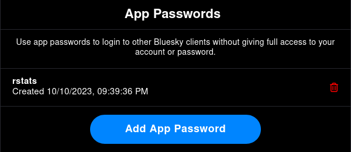
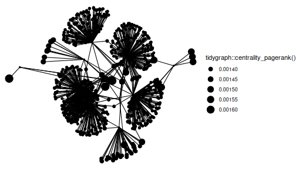

# Introduction


Welcome to the `atrrr` vignette! This guide will delve deeper into the functionalities offered by the package-

Before diving in, let's clarify some terminology. In the context of Blue Sky, a post is referred to as a "skeet." So, when we mention retrieving or working with "skeets," we are talking about individual posts made on Blue Sky.

Now, let's delve deeper into the functionalities that allow users to interact with skeets, followers, and their descriptions.

## Installation

If you haven't done so, you can install the development version of atrrr like so (`pak` works similar to `remotes` here, but it's what the cool kids use now :grin:):

``` r
# install.packages("pak")
pak::pak("JBGruber/atrrr")
```


## Load the package


```r
library(atrrr)
```

## Authentication

The first time you make a request, you will be prompted automatically to enter your user handle and an app password to authenticate `atrrr` to communicate with BlueSky for you.


The page to generate app passwords is also automatically opened for you.



However, you can also trigger this process manually:


```r
auth("jbgruber.bsky.social")
```

This can be useful if you want to replace an old token as it is permanently stored encrypted on disk.

# Searching Posts

The AT protocol defines a search function at `app.bsky.feed.searchPosts`, however, it is not currently active, as far as we could tell.

As soon as the functionality is added by BlueSky, we will implement it here.


# Blue Sky Users and Skeets


## Retrieve user info (`get_user_info`)

A good starting point is understanding a user's digital footprint on the platform. The get_user_info function becomes our handy tool, fetching an array of information about a user. All you need? Their handle!


```r
get_user_info(actor = "atpr.bsky.social")  |>
  dplyr::glimpse()
#> Rows: 1
#> Columns: 8
#> $ did               <chr> "did:plc:j42kj4qc5vfz34…
#> $ indexed_at        <dttm> 1-01-01
#> $ actor_handle      <chr> "atpr.bsky.social"
#> $ actor_name        <chr> NA
#> $ actor_description <chr> NA
#> $ actor_avatar      <chr> NA
#> $ viewer_data       <list> [FALSE, FALSE, "at://d…
#> $ labels_data       <list> []
```

This function gives us counts of followers, follows, posts for each user.

You can also retrieve information for multiple users by providing a vector of user handles:


```r
get_user_info(actor = c("benguinaudeau.bsky.social", "atpr.bsky.social"))  |>
  dplyr::glimpse()
#> Rows: 2
#> Columns: 8
#> $ did               <chr> "did:plc:vuvsifrusnjsys…
#> $ indexed_at        <dttm> 2024-01-26 01:28:47, 1…
#> $ actor_handle      <chr> "benguinaudeau.bsky.soc…
#> $ actor_name        <chr> "Benjamin Guinaudeau", …
#> $ actor_description <chr> "Postdoc @CSMaP_NYU. \n…
#> $ actor_avatar      <chr> "https://cdn.bsky.app/i…
#> $ viewer_data       <list> [FALSE, FALSE, "at://d…
#> $ labels_data       <list> [], []
```


## Retrieve Skeets (`get_skeets_authored_by`)

To fetch all the skeets by a specific user, use the `get_skeets_authored_by` function. *Note this also includes quote skeets and reskeets.* You can also opt not to parse the result by setting `parse = FALSE`, however it is recommended to use the default parse option which results in a (more) tidy tibble.


```r
get_skeets_authored_by(actor = "benguinaudeau.bsky.social", parse = TRUE) |>
  dplyr::glimpse()
#> Rows: 25
#> Columns: 19
#> $ uri           <chr> "at://did:plc:3ryku2cbgpazo…
#> $ cid           <chr> "bafyreiabtdobd6w4scrbpqkvp…
#> $ author_handle <chr> "beamagistro.bsky.social", …
#> $ author_name   <chr> "Beatrice Magistro", "Johan…
#> $ text          <chr> "Excited to share my latest…
#> $ author_data   <list> ["did:plc:3ryku2cbgpazoryt…
#> $ post_data     <list> ["app.bsky.feed.post", "20…
#> $ embed_data    <list> ["app.bsky.embed.images#vi…
#> $ reply_count   <int> 0, 1, 4, 0, 0, 4, 0, 1, 9, …
#> $ repost_count  <int> 6, 6, 8, 0, 0, 15, 2, 1, 44…
#> $ like_count    <int> 12, 20, 12, 0, 1, 43, 6, 1,…
#> $ indexed_at    <dttm> 2024-02-16 17:26:58, 2024-…
#> $ in_reply_to   <chr> NA, NA, NA, NA, "at://did:p…
#> $ in_reply_root <chr> NA, NA, NA, NA, "at://did:p…
#> $ quotes        <chr> NA, "at://did:plc:vgvueqvmb…
#> $ tags          <list> <NULL>, "rstats", "rstats"…
#> $ mentions      <list> <NULL>, <NULL>, <NULL>, <N…
#> $ links         <list> <NULL>, <NULL>, <NULL>, <N…
#> $ is_reskeet    <lgl> TRUE, TRUE, TRUE, FALSE, FA…
```

Feeling adventurous? Increase the `limit` and explore more of their content.


```r
get_skeets_authored_by(actor = "favstats.bsky.social", limit = 30) |>
  dplyr::glimpse()
#> Rows: 30
#> Columns: 19
#> $ uri           <chr> "at://did:plc:46yyakot3bygh…
#> $ cid           <chr> "bafyreihxsllmosnheuxhl234f…
#> $ author_handle <chr> "favstats.bsky.social", "r-…
#> $ author_name   <chr> "Fabio Votta📊🐧 ", "R-Blog…
#> $ text          <chr> "Made an invitation website…
#> $ author_data   <list> ["did:plc:46yyakot3byghwqc…
#> $ post_data     <list> ["app.bsky.feed.post", "20…
#> $ embed_data    <list> ["app.bsky.embed.images#vi…
#> $ reply_count   <int> 0, 0, 0, 4, 1, 0, 4, 0, 0, …
#> $ repost_count  <int> 1, 1, 0, 0, 6, 3, 8, 8, 3, …
#> $ like_count    <int> 5, 5, 2, 13, 20, 3, 12, 23,…
#> $ indexed_at    <dttm> 2024-02-20 12:21:11, 2024-…
#> $ in_reply_to   <chr> NA, NA, "at://did:plc:46yya…
#> $ in_reply_root <chr> NA, NA, "at://did:plc:46yya…
#> $ quotes        <chr> NA, NA, NA, NA, "at://did:p…
#> $ tags          <list> "rstats", <NULL>, <NULL>, …
#> $ mentions      <list> <NULL>, <NULL>, <NULL>, <N…
#> $ links         <list> <NULL>, <NULL>, <NULL>, <N…
#> $ is_reskeet    <lgl> FALSE, TRUE, FALSE, FALSE, …
```


## Who liked your Skeets?

The get_likes function allows you to extract detailed information about users who liked a specific post. By simply providing the post's URL, you can get a list of users who expressed their appreciation for the content.


```r
get_likes("https://bsky.app/profile/ryanlcooper.com/post/3kb42gayda52t")  |>
  dplyr::glimpse()
#> Rows: 25
#> Columns: 5
#> $ created_at   <dttm> 2023-10-06 21:22:39, 2023-1…
#> $ indexed_at   <dttm> 2023-10-06 21:22:39, 2023-1…
#> $ actor_handle <chr> "csehested.bsky.social", "da…
#> $ actor_name   <chr> NA, "TassieDevyl", "Hans LeJ…
#> $ actor_data   <list> ["did:plc:zzsj7hy3wec6fhbwu…
```

## Who reposted your Skeets?

Reposts (or reskeets), akin to retweets on platforms like Twitter, amplify the reach of content by sharing it with a wider audience.

The `get_reposts` function is designed to retrieve information about users who reposted a specific piece of content.


```r
get_reposts(post_url = "https://bsky.app/profile/ryanlcooper.com/post/3kb42gayda52t")  |>
  dplyr::glimpse()
#> Rows: 25
#> Columns: 8
#> $ did               <chr> "did:plc:zyvmwfzbkt3igd…
#> $ indexed_at        <dttm> 2024-01-26 00:03:39, 2…
#> $ actor_handle      <chr> "zunguzungu.bsky.social…
#> $ actor_name        <chr> "Aaron Bady", "Bertie R…
#> $ actor_description <chr> "Meat blood, bees, thin…
#> $ actor_avatar      <chr> "https://cdn.bsky.app/i…
#> $ viewer_data       <list> [FALSE, FALSE], [FALSE…
#> $ labels_data       <list> [], [], [], [], [], []…
```


# Exploring Connections: Get Followers and Follows

You can retrieve a list of followers and those followed by a user through the `get_followers` and `get_follows` functions, respectively. This gives a glimpse of their social dynamics on the platform.

## `get_followers`


```r
get_followers(actor = "benguinaudeau.bsky.social", limit = 200)  |>
  dplyr::glimpse()
#> Rows: 200
#> Columns: 8
#> $ did               <chr> "did:plc:nol67uyam6hzj5…
#> $ indexed_at        <dttm> 2024-02-29 13:50:12, 2…
#> $ actor_handle      <chr> "dkarpa.bsky.social", "…
#> $ actor_name        <chr> "David Karpa", "Rémi Pa…
#> $ actor_description <chr> "PhD-candidate UBremen.…
#> $ actor_avatar      <chr> "https://cdn.bsky.app/i…
#> $ viewer_data       <list> [FALSE, FALSE], [FALSE…
#> $ labels_data       <list> [], [], [], [], [], []…
```


## `get_follows`


```r
atrrr:::get_follows(actor = "benguinaudeau.bsky.social", limit = 200)  |>
  dplyr::glimpse()
#> Rows: 174
#> Columns: 8
#> $ did               <chr> "did:plc:3ryku2cbgpazor…
#> $ indexed_at        <dttm> 2024-02-08 05:16:04, 2…
#> $ actor_handle      <chr> "beamagistro.bsky.socia…
#> $ actor_name        <chr> "Beatrice Magistro", "S…
#> $ actor_description <chr> "PostDoc @Caltech, thru…
#> $ actor_avatar      <chr> "https://cdn.bsky.app/i…
#> $ viewer_data       <list> [FALSE, FALSE], [FALSE…
#> $ labels_data       <list> [], [], [], [], [], []…
```

You'll notice each follower/following has a description (i.e. their bio). It's a nifty way to get to know a bit about them at a glance!


## Follower Network Visualization

This section guides you through the process of visualizing a follower network for a given user on Blue Sky. The primary focus is on the "skeets" (posts) and the interconnected relationships among followers.

The first step is to load some additional packages. Then we get the followers for the main user we are interested in. We will then delve deeper and fetch the followers for each of these followers.


```r
library(ggplot2)
library(dplyr)
library(purrr)
library(tidyr)
library(igraph)
library(ggraph)
library(tidygraph)

# Retrieve the followers for the main user
some_followers <- get_followers(actor = "benguinaudeau.bsky.social", limit = 10)$actor_handle

# For each follower, retrieve their own set of followers.
# This provides a nested view of relationships.
followers_of_followers <- some_followers |>
  purrr::map_dfr(~{
    get_followers(actor = .x, limit = 200) |>
    mutate(from = .x)
  }) |>
  dplyr::rename(to = actor_handle) |>
  dplyr::select(from, to)
```


## Building and Visualizing the Follower Network


```r
# Construct the network graph and plot
graph <- igraph::graph_from_data_frame(followers_of_followers, directed = TRUE)

# Use ggraph to visualize the network.
ggraph::ggraph(graph, layout = "kk") +
  ggraph::geom_edge_link() +
  ggraph::geom_node_point(aes(size = tidygraph::centrality_pagerank())) +
  ggplot2::theme_void()
```

<div class="figure">

<p class="caption">Follower Network</p>
</div>


## Find people to follow

You can use a similar approach to find new people you might want to follow.
First get all the people you already follow by quering your own account:


```r
my_follows <- get_follows(actor = "jbgruber.bsky.social",
                              limit = 10)$actor_handle # limit only for demonstration

# For each account you follow, retrieve who they follow.
follows_of_follows <- my_follows |>
  purrr::map_dfr(~{
    get_followers(actor = .x, limit = 100) |>
      mutate(from = .x)
  })

# Now we can check which accounts are popular among the people you already follow
follows_of_follows |>
  dplyr::filter(!actor_handle %in% my_follows) |> # exclude accounts you already follow
  dplyr::count(actor_name, actor_handle, sort = TRUE)
#> # A tibble: 704 × 3
#>    actor_name                actor_handle         n
#>    <chr>                     <chr>            <int>
#>  1 Johannes B. Gruber        jbgruber.bsky.s…     9
#>  2 Center for Ballot Freedom fusionvoting.bs…     4
#>  3 David Karpa               dkarpa.bsky.soc…     3
#>  4 Jacob Ware                jacobware.bsky.…     3
#>  5 Jens Rydgren              jensrydgren.bsk…     3
#>  6 edminkardes               gorkem.me            3
#>  7 Adrian Florea             aflorea.bsky.so…     2
#>  8 Brian O'Meara             omearabrian.bsk…     2
#>  9 Darren Dahly              statsepi.bsky.s…     2
#> 10 Erik Angner               erikangner.com       2
#> # ℹ 694 more rows
```

The original account shows up in this overview, as do accounts that were excluded because of the limit set to do the demonstration.

But all of these accounts look intresting!


<!-- ### Eventual temporal structure -->
