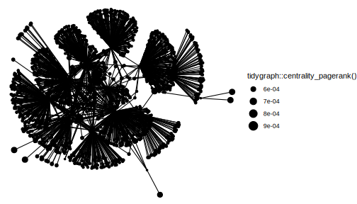

# Introduction


Welcome to the `atrrr` vignette! This guide will delve deeper into the functionalities offered by the package-

Before diving in, let's clarify some terminology. In the context of Blue Sky, a post is referred to as a "skeet." So, when we mention retrieving or working with "skeets," we are talking about individual posts made on Blue Sky.

Now, let's delve deeper into the functionalities that allow users to interact with skeets, followers, and their descriptions.

## Installation

If you haven't done so, you can install the development version of atrrr like so (`pak` works similar to `remotes` here, but it's what the cool kids use now :grin:):

``` r
# install.packages("pak")
pak::pak("JBGruber/atrrr")
```


## Load the package


``` r
library(atrrr)
```

## Authentication

The first time you make a request, you will be prompted automatically to enter your user handle and an app password to authenticate `atrrr` to communicate with BlueSky for you.


The page to generate app passwords is also automatically opened for you.


However, you can also trigger this process manually:


``` r
auth("jbgruber.bsky.social")
```

This can be useful if you want to replace an old token as it is permanently stored encrypted on disk.

# Searching Posts


You can search Posts on Bluesky using a small set of operators:

- Whitespace is treated as implicit AND, so all words in a query must occur
- Double quotes indicate exact phrases
- `from:<handle>` will filter to results from that account
- `-` excludes terms

Note that matches can occur anywhere in the skeet, not just the text.
For example, a term can be in the link preview, or alt text of an image.

A couple of examples:


``` r
search_post("rstats")
#> # A tibble: 100 × 18
#>    uri   cid   author_handle author_name text  author_data  post_data    embed_data   reply_count
#>    <chr> <chr> <chr>         <chr>       <chr> <list>       <list>       <list>             <int>
#>  1 at:/… bafy… tterence.bsk… terence     "Lig… <named list> <named list> <named list>           0
#>  2 at:/… bafy… emazaola.bsk… <NA>        "Mor… <named list> <named list> <named list>           0
#>  3 at:/… bafy… rosenetwork.… RoSE Netwo… "🚨N… <named list> <named list> <named list>           0
#>  4 at:/… bafy… cranberriesf… CRAN Packa… "CRA… <named list> <named list> <NULL>                 0
#>  5 at:/… bafy… avehtari.bsk… Aki Vehtar… "The… <named list> <named list> <named list>           1
#>  6 at:/… bafy… cranberriesf… CRAN Packa… "CRA… <named list> <named list> <NULL>                 0
#>  7 at:/… bafy… jimjamslam.b… James Gold… "💡 … <named list> <named list> <named list>           0
#>  8 at:/… bafy… tterence.bsk… terence     "Riv… <named list> <named list> <named list>           1
#>  9 at:/… bafy… jeremywallac… Jeremy Wal… "Wel… <named list> <named list> <NULL>                 0
#> 10 at:/… bafy… cranberriesf… CRAN Packa… "CRA… <named list> <named list> <NULL>                 0
#> # ℹ 90 more rows
#> # ℹ 9 more variables: repost_count <int>, like_count <int>, indexed_at <dttm>,
#> #   in_reply_to <chr>, in_reply_root <chr>, quotes <chr>, tags <list>, mentions <list>,
#> #   links <list>
```

This finds posts where "rstats" is found somewhere in the post.


``` r
search_post("#rstats Bluesky")
#> # A tibble: 34 × 18
#>    uri   cid   author_handle author_name text  author_data  post_data    embed_data   reply_count
#>    <chr> <chr> <chr>         <chr>       <chr> <list>       <list>       <list>             <int>
#>  1 at:/… bafy… gdeejay.bsky… Giles       "One… <named list> <named list> <NULL>                 0
#>  2 at:/… bafy… dariia.bsky.… Dariia Myk… "Blu… <named list> <named list> <named list>           0
#>  3 at:/… bafy… o.simardcasa… Olivier Si… "Thi… <named list> <named list> <named list>          16
#>  4 at:/… bafy… thomascwells… Thomas W    "Jus… <named list> <named list> <named list>           0
#>  5 at:/… bafy… nrennie.bsky… Nicola Ren… "A r… <named list> <named list> <named list>           0
#>  6 at:/… bafy… o.simardcasa… Olivier Si… "The… <named list> <named list> <named list>           0
#>  7 at:/… bafy… thoughtfulnz… David Hood  "Che… <named list> <named list> <NULL>                 1
#>  8 at:/… bafy… o.simardcasa… Olivier Si… "Wit… <named list> <named list> <named list>           2
#>  9 at:/… bafy… seacatkim.bs… Catherine   "Hel… <named list> <named list> <NULL>                 4
#> 10 at:/… bafy… thoughtfulnz… David Hood  "#30… <named list> <named list> <named list>           2
#> # ℹ 24 more rows
#> # ℹ 9 more variables: repost_count <int>, like_count <int>, indexed_at <dttm>,
#> #   in_reply_to <chr>, in_reply_root <chr>, quotes <chr>, tags <list>, mentions <list>,
#> #   links <list>
```

This finds posts with the hashtag "rstats" AND the word Bluesky somewhere in the skeet (ignoring capitalisaion).

You can also search for the exact phrase "new #rstats package":


``` r
search_post("\"new #rstats package\"")
#> # A tibble: 17 × 18
#>    uri   cid   author_handle author_name text  author_data  post_data    embed_data   reply_count
#>    <chr> <chr> <chr>         <chr>       <chr> <list>       <list>       <list>             <int>
#>  1 at:/… bafy… seabbs.bsky.… "Sam Abbot… "New… <named list> <named list> <named list>           1
#>  2 at:/… bafy… coatless.bsk… "James Bal… "Int… <named list> <named list> <named list>           0
#>  3 at:/… bafy… heinersalomo… "Heiner Sa… "Thi… <named list> <named list> <named list>           1
#>  4 at:/… bafy… egorkotov.bs… "Egor Koto… "We'… <named list> <named list> <named list>           0
#>  5 at:/… bafy… egorkotov.bs… "Egor Koto… "Fai… <named list> <named list> <named list>           0
#>  6 at:/… bafy… frodsan.bsky… "Francisco… "Thi… <named list> <named list> <named list>           1
#>  7 at:/… bafy… simonpcouch.… "Simon P. … "🚨N… <named list> <named list> <named list>           0
#>  8 at:/… bafy… posit.co      "Posit"     "We’… <named list> <named list> <named list>           0
#>  9 at:/… bafy… chriskenny.b… "Chris Ken… "New… <named list> <named list> <named list>           0
#> 10 at:/… bafy… robjhyndman.… "Rob Hyndm… "My … <named list> <named list> <named list>           0
#> 11 at:/… bafy… cghlewis.bsk… "Crystal L… "Whe… <named list> <named list> <named list>           0
#> 12 at:/… bafy… jbgruber.bsk… "Johannes … "New… <named list> <named list> <named list>           1
#> 13 at:/… bafy… mikemahoney2… "Mike Maho… "📣 … <named list> <named list> <named list>           0
#> 14 at:/… bafy… mikemahoney2… "Mike Maho… "Exc… <named list> <named list> <named list>           0
#> 15 at:/… bafy… jbgruber.bsk… "Johannes … "New… <named list> <named list> <named list>           1
#> 16 at:/… bafy… pciarchaeolo… ""          "2/3… <named list> <named list> <named list>           1
#> 17 at:/… bafy… eddelbuettel… "Dirk Edde… "Eve… <named list> <named list> <named list>           0
#> # ℹ 9 more variables: repost_count <int>, like_count <int>, indexed_at <dttm>,
#> #   in_reply_to <chr>, in_reply_root <chr>, quotes <chr>, tags <list>, mentions <list>,
#> #   links <list>
```

``` r
#' # Use single quotes so you do not need to escape double quotes
#' search_post('"new #rstats package"')
```

You can also limit your search by only looking for skeets from one user:


``` r
search_post("from:jbgruber.bsky.social #rstats")
#> # A tibble: 31 × 18
#>    uri   cid   author_handle author_name text  author_data  post_data    embed_data   reply_count
#>    <chr> <chr> <chr>         <chr>       <chr> <list>       <list>       <list>             <int>
#>  1 at:/… bafy… jbgruber.bsk… Johannes B… "Tes… <named list> <named list> <named list>           0
#>  2 at:/… bafy… jbgruber.bsk… Johannes B… "Tes… <named list> <named list> <named list>           0
#>  3 at:/… bafy… jbgruber.bsk… Johannes B… "Tes… <named list> <named list> <NULL>                 0
#>  4 at:/… bafy… jbgruber.bsk… Johannes B… "lla… <named list> <named list> <named list>           1
#>  5 at:/… bafy… jbgruber.bsk… Johannes B… "I t… <named list> <named list> <named list>           1
#>  6 at:/… bafy… jbgruber.bsk… Johannes B… "I j… <named list> <named list> <named list>           1
#>  7 at:/… bafy… jbgruber.bsk… Johannes B… "I a… <named list> <named list> <named list>           1
#>  8 at:/… bafy… jbgruber.bsk… Johannes B… "Che… <named list> <named list> <named list>           1
#>  9 at:/… bafy… jbgruber.bsk… Johannes B… "For… <named list> <named list> <named list>           0
#> 10 at:/… bafy… jbgruber.bsk… Johannes B… "My … <named list> <named list> <named list>           0
#> # ℹ 21 more rows
#> # ℹ 9 more variables: repost_count <int>, like_count <int>, indexed_at <dttm>,
#> #   in_reply_to <chr>, in_reply_root <chr>, quotes <chr>, tags <list>, mentions <list>,
#> #   links <list>
```

# Blue Sky Users and Skeets


## Retrieve user info (`get_user_info`)

A good starting point is understanding a user's digital footprint on the platform. The get_user_info function becomes our handy tool, fetching an array of information about a user. All you need? Their handle!


``` r
get_user_info(actor = "atpr.bsky.social")  |>
  dplyr::glimpse()
#> Rows: 1
#> Columns: 8
#> $ did               <chr> "did:plc:j42kj4qc5vfz344weywpkair"
#> $ indexed_at        <dttm> 1-01-01
#> $ actor_handle      <chr> "atpr.bsky.social"
#> $ actor_name        <chr> NA
#> $ actor_description <chr> NA
#> $ actor_avatar      <chr> NA
#> $ viewer_data       <list> [FALSE, FALSE, "at://did:plc:ntd53albt5ffa4rgervvgibd/app.bsky.graph.…
#> $ labels_data       <list> []
```

This function gives us counts of followers, follows, posts for each user.

You can also retrieve information for multiple users by providing a vector of user handles:


``` r
get_user_info(actor = c("benguinaudeau.bsky.social", "atpr.bsky.social"))  |>
  dplyr::glimpse()
#> Rows: 2
#> Columns: 8
#> $ did               <chr> "did:plc:vuvsifrusnjsys7mhkpk662u", "did:plc:j42kj4qc5vfz344weywpkair"
#> $ indexed_at        <dttm> 2024-01-26 01:28:47, 1-01-01 00:00:00
#> $ actor_handle      <chr> "benguinaudeau.bsky.social", "atpr.bsky.social"
#> $ actor_name        <chr> "Benjamin Guinaudeau", NA
#> $ actor_description <chr> "Postdoc @CSMaP_NYU. \n\nPolitics, data science, and hacking stuff in…
#> $ actor_avatar      <chr> "https://cdn.bsky.app/img/avatar/plain/did:plc:vuvsifrusnjsys7mhkpk6…
#> $ viewer_data       <list> [FALSE, FALSE, "at://did:plc:ntd53albt5ffa4rgervvgibd/app.bsky.graph.…
#> $ labels_data       <list> [], []
```


## Retrieve Skeets (`get_skeets_authored_by`)

To fetch all the skeets by a specific user, use the `get_skeets_authored_by` function. *Note this also includes quote skeets and reskeets.* You can also opt not to parse the result by setting `parse = FALSE`, however it is recommended to use the default parse option which results in a (more) tidy tibble.


``` r
get_skeets_authored_by(actor = "benguinaudeau.bsky.social", parse = TRUE) |>
  dplyr::glimpse()
#> Rows: 25
#> Columns: 19
#> $ uri           <chr> "at://did:plc:f5jstfwgvzacfsdjjdia4466/app.bsky.feed.post/3knyr4ydsqb2w",…
#> $ cid           <chr> "bafyreieqiqwb4wwzosmx4jg3cee5ob2guc6qnjswkridxokkh23fm6wghq", "bafyreiab…
#> $ author_handle <chr> "jacobmontgomery.bsky.social", "beamagistro.bsky.social", "jbgruber.bsky.…
#> $ author_name   <chr> "I jacob, the pumpkin king 🎃 👑 ", "Beatrice Magistro", "Johannes B. Gru…
#> $ text          <chr> "Seriously? Not a single woman instructor, presenter, or organizer for a …
#> $ author_data   <list> ["did:plc:f5jstfwgvzacfsdjjdia4466", "jacobmontgomery.bsky.social", "I j…
#> $ post_data     <list> ["app.bsky.feed.post", "2024-03-18T21:09:28.158Z", ["app.bsky.embed.exte…
#> $ embed_data    <list> ["app.bsky.embed.external#view", ["https://www.law.northwestern.edu/rese…
#> $ reply_count   <int> 0, 0, 1, 4, 0, 0, 4, 0, 1, 9, 0, 1, 0, 1, 0, 0, 0, 0, 1, 12, 0, 0, 1, 1, 1
#> $ repost_count  <int> 3, 6, 6, 8, 0, 0, 15, 2, 1, 431, 3, 1, 5, 28, 0, 0, 0, 0, 0, 289, 14, 1, …
#> $ like_count    <int> 13, 12, 20, 13, 1, 1, 42, 6, 1, 609, 7, 3, 10, 35, 1, 0, 1, 3, 2, 453, 37…
#> $ indexed_at    <dttm> 2024-03-18 21:09:28, 2024-02-16 17:26:58, 2024-01-10 15:23:18, 2024-01-04…
#> $ in_reply_to   <chr> NA, NA, NA, NA, NA, "at://did:plc:eotrvt2wp6mqooxjf3bzklwa/app.bsky.feed…
#> $ in_reply_root <chr> NA, NA, NA, NA, NA, "at://did:plc:eotrvt2wp6mqooxjf3bzklwa/app.bsky.feed.…
#> $ quotes        <chr> NA, NA, "at://did:plc:vgvueqvmbqgoyxtcdebqdcgb/app.bsky.feed.post/3kin4vi…
#> $ tags          <list> <NULL>, <NULL>, "rstats", "rstats", <NULL>, <NULL>, <NULL>, <NULL>, "AoE"…
#> $ mentions      <list> <NULL>, <NULL>, <NULL>, <NULL>, <NULL>, <NULL>, <NULL>, <NULL>, <NULL>, …
#> $ links         <list> <NULL>, <NULL>, <NULL>, <NULL>, <NULL>, <NULL>, <NULL>, <NULL>, <NULL>, …
#> $ is_reskeet    <lgl> TRUE, TRUE, TRUE, TRUE, FALSE, FALSE, TRUE, TRUE, FALSE, TRUE, FALSE, TR…
```

Feeling adventurous? Increase the `limit` and explore more of their content.


``` r
get_skeets_authored_by(actor = "favstats.bsky.social", limit = 30) |>
  dplyr::glimpse()
#> Rows: 30
#> Columns: 19
#> $ uri           <chr> "at://did:plc:7ao77wemnhl63qnpuy7psebr/app.bsky.feed.post/3l55lu5ebts24",…
#> $ cid           <chr> "bafyreibgmqfbgls7rvgusnr4k6arykcsmwvxkpiev6nlh5pel5inx3lusa", "bafyreiea…
#> $ author_handle <chr> "whotargetsme.bsky.social", "whotargetsme.bsky.social", "favstats.bsky.so…
#> $ author_name   <chr> "Who Targets Me", "Who Targets Me", "Fabio Votta📊🐧 ", "Johannes B. Grub…
#> $ text          <chr> "Interesting how Democrats and Republicans are competing to target Latino…
#> $ author_data   <list> ["did:plc:7ao77wemnhl63qnpuy7psebr", "whotargetsme.bsky.social", "Who Ta…
#> $ post_data     <list> ["app.bsky.feed.post", "2024-09-27T16:36:15.797Z", ["app.bsky.embed.imag…
#> $ embed_data    <list> ["app.bsky.embed.images#view", [["https://cdn.bsky.app/img/feed_thumbnai…
#> $ reply_count   <int> 1, 0, 0, 1, 0, 0, 0, 1, 0, 1, 1, 1, 1, 1, 1, 1, 1, 1, 1, 1, 1, 1, 1, 1, 0…
#> $ repost_count  <int> 1, 1, 0, 8, 5, 0, 2, 7, 0, 0, 0, 0, 0, 0, 0, 0, 0, 0, 0, 0, 0, 0, 0, 7, 0…
#> $ like_count    <int> 1, 2, 2, 13, 5, 0, 1, 10, 0, 1, 1, 1, 1, 1, 1, 1, 1, 1, 1, 1, 1, 1, 1, 10…
#> $ indexed_at    <dttm> 2024-09-27 16:36:15, 2024-09-27 16:38:18, 2024-09-19 16:33:57, 2024-09-1…
#> $ in_reply_to   <chr> NA, "at://did:plc:7ao77wemnhl63qnpuy7psebr/app.bsky.feed.post/3l55lu5ebts…
#> $ in_reply_root <chr> NA, "at://did:plc:7ao77wemnhl63qnpuy7psebr/app.bsky.feed.post/3l55lu5ebts…
#> $ quotes        <chr> NA, NA, NA, NA, NA, NA, "at://did:plc:46yyakot3byghwqc6rhmqzqd/app.bsky.f…
#> $ tags          <list> <NULL>, <NULL>, <NULL>, <NULL>, <NULL>, <NULL>, <NULL>, <NULL>, <NULL>, …
#> $ mentions      <list> <NULL>, <NULL>, <NULL>, <NULL>, <NULL>, <NULL>, <NULL>, <NULL>, <NULL>, …
#> $ links         <list> <NULL>, <NULL>, <NULL>, <NULL>, <NULL>, <NULL>, <NULL>, <NULL>, <NULL>, …
#> $ is_reskeet    <lgl> TRUE, TRUE, FALSE, TRUE, TRUE, FALSE, TRUE, FALSE, FALSE, FALSE, FALSE, F…
```


## Who liked your Skeets?

The get_likes function allows you to extract detailed information about users who liked a specific post. By simply providing the post's URL, you can get a list of users who expressed their appreciation for the content.


``` r
get_likes("https://bsky.app/profile/ryanlcooper.com/post/3kb42gayda52t")  |>
  dplyr::glimpse()
#> Rows: 25
#> Columns: 5
#> $ created_at   <dttm> 2024-02-29 22:14:52, 2024-02-26 13:03:05, 2024-02-23 23:38:41, 2024-01-25…
#> $ indexed_at   <dttm> 2024-02-29 22:14:52, 2024-02-26 13:03:05, 2024-02-23 23:38:41, 2024-01-25…
#> $ actor_handle <chr> "dsfpspacefl1ght.bsky.social", "demonchuckle.bsky.social", "butpawwwlll.bs…
#> $ actor_name   <chr> "David S. F. Portree, quasi-retired writer, archivist, & educator", "Demon…
#> $ actor_data   <list> ["did:plc:b3igxlkvw5hbsjxurrv2xb74", "dsfpspacefl1ght.bsky.social", "Davi…
```

## Who reposted your Skeets?

Reposts (or reskeets), akin to retweets on platforms like Twitter, amplify the reach of content by sharing it with a wider audience.

The `get_reposts` function is designed to retrieve information about users who reposted a specific piece of content.


``` r
get_reposts(post_url = "https://bsky.app/profile/ryanlcooper.com/post/3kb42gayda52t")  |>
  dplyr::glimpse()
#> Rows: 25
#> Columns: 8
#> $ did               <chr> "did:plc:zyvmwfzbkt3igdqgpemu3pot", "did:plc:zyb3zoeo2snrj6ugwirudqys…
#> $ indexed_at        <dttm> 2024-01-26 00:03:39, 2024-01-26 00:35:53, 2024-03-21 11:54:36, 2024-…
#> $ actor_handle      <chr> "zunguzungu.bsky.social", "bertierustle.bsky.social", "gebi.bsky.soci…
#> $ actor_name        <chr> "Aaron Bady", "Bertie Rustle", "Michael Gebetsroither", "Amanda Katz"…
#> $ actor_description <chr> "Meat blood, bees, things of that nature", "Mouthy leftist/Giver Godd…
#> $ actor_avatar      <chr> "https://cdn.bsky.app/img/avatar/plain/did:plc:zyvmwfzbkt3igdqgpemu3p…
#> $ viewer_data       <list> [FALSE, FALSE], [FALSE, FALSE], [FALSE, FALSE], [FALSE, FALSE], [FAL…
#> $ labels_data       <list> [], [], [], [], [], [], [], [], [["did:plc:zrrfehir5gdxoapcddwea2fg"…
```


# Exploring Connections: Get Followers and Follows

You can retrieve a list of followers and those followed by a user through the `get_followers` and `get_follows` functions, respectively. This gives a glimpse of their social dynamics on the platform.

## `get_followers`


``` r
get_followers(actor = "benguinaudeau.bsky.social", limit = 200)  |>
  dplyr::glimpse()
#> Rows: 299
#> Columns: 8
#> $ did               <chr> "did:plc:c27h545kxtb7yyh7zg3jkdsm", "did:plc:l3rfgtccdg3lkqg3nbhgnwk3…
#> $ indexed_at        <dttm> 2024-09-18 05:31:06, 2024-09-21 22:04:38, 2024-09-18 07:22:44, 2024-…
#> $ actor_handle      <chr> "goodword2654.bsky.social", "andreucasas.bsky.social", "earth-pic.bsk…
#> $ actor_name        <chr> "좋은글", "Andreu Casas", "Earth pic", "Anton Strezhnev", "Lawrence M…
#> $ actor_description <chr> "매일 아침 마음을 깨우는 시 한 편\n꽃처럼 아름다운 하루가 당신에게 꽃…
#> $ actor_avatar      <chr> "https://cdn.bsky.app/img/avatar/plain/did:plc:c27h545kxtb7yyh7zg3jkd…
#> $ viewer_data       <list> [FALSE, FALSE], [FALSE, FALSE, "at://did:plc:ntd53albt5ffa4rgervvgib…
#> $ labels_data       <list> [], [], [], [], [], [], [], [], [], [], [], [], [], [], [], [], [], …
```


## `get_follows`


``` r
atrrr:::get_follows(actor = "benguinaudeau.bsky.social", limit = 200)  |>
  dplyr::glimpse()
#> Rows: 173
#> Columns: 8
#> $ did               <chr> "did:plc:3ryku2cbgpazorytvt6lt273", "did:plc:miczfsfixolk42l7343z3bpd…
#> $ indexed_at        <dttm> 2024-02-08 05:16:04, 2024-01-25 23:49:49, 2024-01-25 23:51:33, 2024-…
#> $ actor_handle      <chr> "beamagistro.bsky.social", "sethcotlar.bsky.social", "aoc.bsky.social…
#> $ actor_name        <chr> "Beatrice Magistro", "Seth Cotlar", "Alexandria Ocasio-Cortez", "CRAN…
#> $ actor_description <chr> "PostDoc @Caltech, thru @UofT. Poli Sci PhD \n@UW-Seattle. 🇮🇹🇪🇺🇺🇸🇨🇦, …
#> $ actor_avatar      <chr> "https://cdn.bsky.app/img/avatar/plain/did:plc:3ryku2cbgpazorytvt6lt2…
#> $ viewer_data       <list> [FALSE, FALSE], [FALSE, FALSE], [FALSE, FALSE], [FALSE, FALSE, "at:/…
#> $ labels_data       <list> [], [], [], [], [], [], [], [], [], [], [], [], [], [], [], [], [], …
```

You'll notice each follower/following has a description (i.e. their bio). It's a nifty way to get to know a bit about them at a glance!


## Follower Network Visualization

This section guides you through the process of visualizing a follower network for a given user on Blue Sky. The primary focus is on the "skeets" (posts) and the interconnected relationships among followers.

The first step is to load some additional packages. Then we get the followers for the main user we are interested in. We will then delve deeper and fetch the followers for each of these followers.


``` r
library(ggplot2)
library(dplyr)
library(purrr)
library(tidyr)
library(igraph)
library(ggraph)
library(tidygraph)

# Retrieve the followers for the main user
some_followers <- get_followers(actor = "benguinaudeau.bsky.social", limit = 10)$actor_handle

# For each follower, retrieve their own set of followers.
# This provides a nested view of relationships.
followers_of_followers <- some_followers |>
  purrr::map_dfr(~{
    get_followers(actor = .x, limit = 200) |>
    mutate(from = .x)
  }) |>
  dplyr::rename(to = actor_handle) |>
  dplyr::select(from, to)
```


## Building and Visualizing the Follower Network


``` r
# Construct the network graph and plot
graph <- igraph::graph_from_data_frame(followers_of_followers, directed = TRUE)

# Use ggraph to visualize the network.
ggraph::ggraph(graph, layout = "kk") +
  ggraph::geom_edge_link() +
  ggraph::geom_node_point(aes(size = tidygraph::centrality_pagerank())) +
  ggplot2::theme_void()
```

<div class="figure">

<p class="caption">Follower Network</p>
</div>


## Find people to follow

You can use a similar approach to find new people you might want to follow.
First get all the people you already follow by quering your own account:


``` r
my_follows <- get_follows(actor = "jbgruber.bsky.social",
                              limit = 10)$actor_handle # limit only for demonstration

# For each account you follow, retrieve who they follow.
follows_of_follows <- my_follows |>
  purrr::map_dfr(~{
    get_followers(actor = .x, limit = 100) |>
      mutate(from = .x)
  })

# Now we can check which accounts are popular among the people you already follow
follows_of_follows |>
  dplyr::filter(!actor_handle %in% my_follows) |> # exclude accounts you already follow
  dplyr::count(actor_name, actor_handle, sort = TRUE)
#> # A tibble: 1,393 × 3
#>    actor_name                actor_handle                     n
#>    <chr>                     <chr>                        <int>
#>  1 "Johannes B. Gruber"      jbgruber.bsky.social             7
#>  2 "Analytical Sociology"    iasliu.bsky.social               3
#>  3 "Jihed Ncib"              jihedncib.bsky.social            3
#>  4 "Prof David Farrell, UCD" davidfarrell-ucd.bsky.social     3
#>  5 ""                        ab4aba.bsky.social               2
#>  6 ""                        uupeace.bsky.social              2
#>  7 "Alexandre Raffoul"       awraffoul.bsky.social            2
#>  8 "Allison Koh"             allisonwkoh.bsky.social          2
#>  9 "Amar jeet"               amarjeat.bsky.social             2
#> 10 "Andreas Hövermann "      andreashoev.bsky.social          2
#> # ℹ 1,383 more rows
```

The original account shows up in this overview, as do accounts that were excluded because of the limit set to do the demonstration.

But all of these accounts look intresting!


<!-- ### Eventual temporal structure -->
