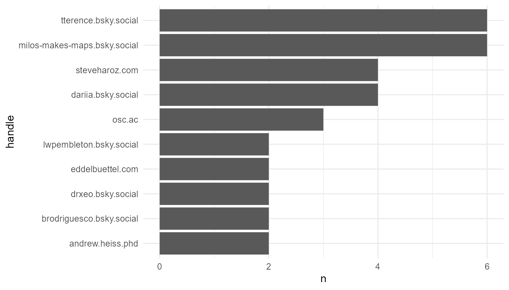
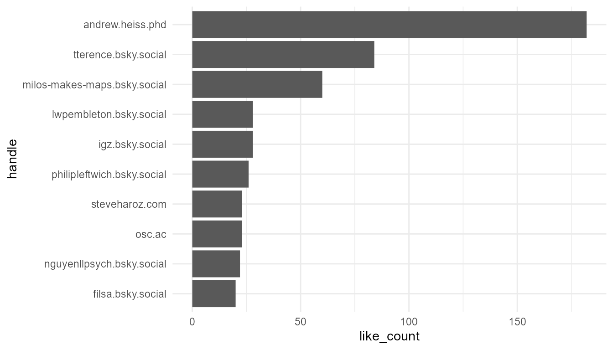

# Analyzing Feeds on Blue Sky

On Blue Sky users have the ability to create custom feeds based on specific keywords. These feeds aggregate content, for instance, a user might create a feed around the hashtag `#rstats` to gather all relevant content about. Let's delve into the dynamics of such feeds created by users.

## Load the package


``` r
library(atrrr)
```

## Retrieving a Feed

Our starting point is to extract the posts from a feed. We're focusing on a feed curated by "andrew.heiss.phd".


``` r
# Fetching the feed posts
feeds <- get_feeds_created_by(actor = "andrew.heiss.phd") |>
  dplyr::glimpse()
#> Rows: 4
#> Columns: 20
#> $ uri                       <chr> "at://did:plc:2…
#> $ cid                       <chr> "bafyreidmykchh…
#> $ did                       <chr> "did:web:skyfee…
#> $ creator_did               <chr> "did:plc:2zcfjz…
#> $ creator_handle            <chr> "andrew.heiss.p…
#> $ creator_displayName       <chr> "Andrew Heiss",…
#> $ creator_avatar            <chr> "https://cdn.bs…
#> $ creator_viewer_muted      <lgl> FALSE, FALSE, F…
#> $ creator_viewer_blockedBy  <lgl> FALSE, FALSE, F…
#> $ creator_viewer_following  <chr> "at://did:plc:n…
#> $ creator_viewer_followedBy <chr> "at://did:plc:2…
#> $ creator_description       <chr> "Assistant prof…
#> $ creator_indexedAt         <chr> "2024-01-26T00:…
#> $ displayName               <chr> "Nonprofit Stud…
#> $ description               <chr> "A feed for non…
#> $ avatar                    <chr> "https://cdn.bs…
#> $ likeCount                 <int> 20, 81, 0, 102
#> $ indexedAt                 <chr> "2023-09-20T21:…
#> $ created_at                <dttm> 2023-09-20 21:1…
#> $ viewer_like               <chr> NA, NA, NA, "a…

# Filtering for a specific keyword, for example "#rstats"
rstat_feed <- feeds |>
  filter(displayName == "#rstats")

# Extracting posts from this curated feed
rstat_posts <- get_feed(rstat_feed$uri, limit = 200) |>
  dplyr::glimpse()
#> Rows: 200
#> Columns: 18
#> $ uri           <chr> "at://did:plc:vgvueqvmbqgoy…
#> $ cid           <chr> "bafyreie2uewopzpmtxwil3a5p…
#> $ author_handle <chr> "cranberriesfeed.bsky.socia…
#> $ author_name   <chr> "CRAN Package Updates Bot",…
#> $ text          <chr> "CRAN updates: lava MissMec…
#> $ author_data   <list> ["did:plc:vgvueqvmbqgoyxtc…
#> $ post_data     <list> ["app.bsky.feed.post", "20…
#> $ embed_data    <list> <NULL>, <NULL>, ["app.bsky…
#> $ reply_count   <int> 0, 0, 0, 0, 0, 0, 0, 0, 2, …
#> $ repost_count  <int> 0, 0, 0, 0, 0, 0, 0, 0, 0, …
#> $ like_count    <int> 0, 0, 0, 0, 0, 0, 0, 0, 6, …
#> $ indexed_at    <dttm> 2024-03-05 13:02:18, 2024-…
#> $ in_reply_to   <chr> NA, NA, NA, NA, NA, NA, NA,…
#> $ in_reply_root <chr> NA, NA, NA, NA, NA, NA, NA,…
#> $ quotes        <chr> NA, NA, NA, NA, NA, NA, NA,…
#> $ tags          <list> "rstats", "rstats", "rstat…
#> $ mentions      <list> <NULL>, <NULL>, <NULL>, <N…
#> $ links         <list> <NULL>, <NULL>, <NULL>, <N…
```


## Identifying Top Contributors

Who are the leading voices within a particular topic? This analysis highlights users who are frequently contributing to the `#rstats` feed.


``` r
library(ggplot2)

# Identifying the top 10 contributors
rstat_posts |>
  count(handle = author_handle, sort = T) |>
  slice(1:10) |>
  mutate(handle = forcats::fct_reorder(handle, n)) |>
  ggplot(aes(handle, n)) +
  geom_col() +
  coord_flip() +
  theme_minimal()
```

<div class="figure">

<p class="caption">Top 10 #rstats contributors</p>
</div>


### Recognizing Influential Voices

Volume doesn't always translate to influence. Some users may post less frequently but their contributions resonate deeply with the community.


``` r
# Identifying top 10 influential voices based on likes
rstat_posts |>
  group_by(author_handle) |>
  summarize(like_count = sum(like_count)) |>
  ungroup() |>
  arrange(desc(like_count)) |>
  slice(1:10) |>
  mutate(handle = forcats::fct_reorder(author_handle, like_count)) |>
  ggplot(aes(handle, like_count)) +
  geom_col() +
  coord_flip() +
  theme_minimal()
```

<div class="figure">

<p class="caption">Top 10 #rstats contributors based on likes</p>
</div>


### Most Famous #rstats skeet


``` r
# Finding the standout post in the rstats feed
rstat_posts |>
  mutate(total_interactions = reply_count + repost_count + like_count) |>
  arrange(desc(total_interactions)) |>
  slice(1) |>
  select(author_handle, total_interactions, text) |>
  dplyr::glimpse() |>
  pull(text)
#> Rows: 1
#> Columns: 3
#> $ author_handle      <chr> "omearabrian.bsky.soci…
#> $ total_interactions <int> 42
#> $ text               <chr> "New paper! \"dentist:…
#> [1] "New paper! \"dentist: Quantifying uncertainty by sampling points around maximum likelihood estimates\". Easy thing to plug into R workflows for getting better confidence intervals and detecting potential identifiability issues. #OpenAccess paper at doi.org/10.1111/2041...\n\n#Rstats #OpenSource"
```
