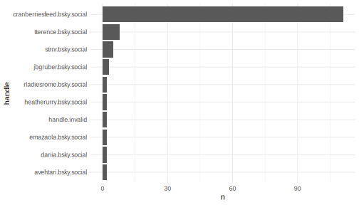

# Analyzing Feeds on Blue Sky

On Blue Sky users have the ability to create custom feeds based on specific keywords. These feeds aggregate content, for instance, a user might create a feed around the hashtag `#rstats` to gather all relevant content about. Let's delve into the dynamics of such feeds created by users.

## Load the package


```r
library(atr)
```

## Retrieving a Feed

Our starting point is to extract the posts from a feed. We're focusing on a feed curated by "andrew.heiss.phd".


```r
# Fetching the feed posts
feeds <- get_feeds_created_by(actor = "andrew.heiss.phd") |>
  dplyr::glimpse()
#> Rows: 4
#> Columns: 20
#> $ uri                       <chr> "at://did:plc:2zcfjzyocp6kapg6jc4eacok/app.bsky.feed.ge…
#> $ cid                       <chr> "bafyreicvjczzxxhrkrl4c2xvfu7yhnm2ad7efzom6bohzy777shu6…
#> $ did                       <chr> "did:web:skyfeed.me", "did:web:skyfeed.me", "did:web:sk…
#> $ creator_did               <chr> "did:plc:2zcfjzyocp6kapg6jc4eacok", "did:plc:2zcfjzyocp…
#> $ creator_handle            <chr> "andrew.heiss.phd", "andrew.heiss.phd", "andrew.heiss.p…
#> $ creator_displayName       <chr> "Andrew Heiss (🎄festive version ⛄️)", "Andrew Heiss (…
#> $ creator_description       <chr> "Assistant professor at Georgia State University. 6 kid…
#> $ creator_avatar            <chr> "https://cdn.bsky.app/img/avatar/plain/did:plc:2zcfjzyo…
#> $ creator_indexedAt         <chr> "2023-11-26T17:07:49.687Z", "2023-11-26T17:07:49.687Z",…
#> $ creator_viewer_muted      <lgl> FALSE, FALSE, FALSE, FALSE
#> $ creator_viewer_blockedBy  <lgl> FALSE, FALSE, FALSE, FALSE
#> $ creator_viewer_following  <chr> "at://did:plc:ntd53albt5ffa4rgervvgibd/app.bsky.graph.f…
#> $ creator_viewer_followedBy <chr> "at://did:plc:2zcfjzyocp6kapg6jc4eacok/app.bsky.graph.f…
#> $ displayName               <chr> "Public Admin/Policy", "Nonprofit Studies", "Andrew Hei…
#> $ description               <chr> "A feed for public administration and public policy res…
#> $ avatar                    <chr> "https://cdn.bsky.app/img/avatar/plain/did:plc:2zcfjzyo…
#> $ likeCount                 <int> 80, 19, 0, 93
#> $ indexedAt                 <chr> "2023-09-21T01:37:55.774Z", "2023-09-21T01:11:24.078Z",…
#> $ created_at                <dttm> 2023-09-21 01:37:55, 2023-09-21 01:11:24, 2023-09-21 00…
#> $ viewer_like               <chr> NA, NA, NA, "at://did:plc:ntd53albt5ffa4rgervvgibd/app.…

# Filtering for a specific keyword, for example "#rstats"
rstat_feed <- feeds |>
  filter(displayName == "#rstats")

# Extracting posts from this curated feed
rstat_posts <- get_feed(rstat_feed$uri, limit = 200) |>
  # Extracting user handle from the author
  mutate(handle = author |> map_chr(~{.x$handle}))  |>
  dplyr::glimpse()
#> Rows: 122
#> Columns: 11
#> $ uri          <chr> "at://did:plc:eud5k5xodg6ilcnngpaa7yzg/app.bsky.feed.post/3kgtethky2…
#> $ cid          <chr> "bafyreib6uif4rndjwfgf4f4e7ru4kbzrcczq4ln5jnrrn2kbs4pjn2ddwe", "bafy…
#> $ author       <list> ["did:plc:eud5k5xodg6ilcnngpaa7yzg", "ryanahart.bsky.social", "Ryan…
#> $ text         <chr> "#TidyTuesday | Week 51 | Holiday Episodes\n\nAverage user ratings o…
#> $ record       <list> ["#TidyTuesday | Week 51 | Holiday Episodes\n\nAverage user ratings…
#> $ reply_count  <int> 0, 0, 0, 0, 2, 0, 0, 0, 0, 0, 0, 0, 0, 0, 0, 0, 0, 0, 0, 0, 0, 0, 0,…
#> $ repost_count <int> 0, 0, 0, 0, 3, 0, 0, 0, 1, 2, 0, 0, 5, 0, 0, 0, 2, 0, 2, 1, 0, 0, 2,…
#> $ like_count   <int> 0, 1, 6, 0, 13, 3, 3, 3, 4, 4, 1, 1, 1, 6, 0, 0, 8, 7, 1, 8, 0, 0, 1…
#> $ indexed_at   <dttm> 2023-12-18 15:49:43, 2023-12-18 13:13:15, 2023-12-18 12:51:42, 2023…
#> $ reply        <list> <NULL>, <NULL>, <NULL>, <NULL>, <NULL>, <NULL>, <NULL>, <NULL>, <NU…
#> $ handle       <chr> "ryanahart.bsky.social", "eddelbuettel.com", "tterence.bsky.social",…
```


## Identifying Top Contributors

Who are the leading voices within a particular topic? This analysis highlights users who are frequently contributing to the `#rstats` feed.


```r
library(ggplot2)

# Identifying the top 10 contributors
rstat_posts |>
  count(handle, sort = T) |>
  slice(1:10) |>
  mutate(handle = forcats::fct_reorder(handle, n)) |>
  ggplot(aes(handle, n)) +
  geom_col() +
  coord_flip() +
  theme_minimal()
```

<div class="figure">

<p class="caption">Top 10 #rstats contributors</p>
</div>


### Recognizing Influential Voices

Volume doesn't always translate to influence. Some users may post less frequently but their contributions resonate deeply with the community.


```r
# Identifying top 10 influential voices based on likes
rstat_posts |>
  group_by(handle) |>
  summarize(like_count = sum(like_count)) |>
  ungroup() |>
  arrange(desc(like_count)) |>
  slice(1:10) |>
  mutate(handle = forcats::fct_reorder(handle, like_count)) |>
  ggplot(aes(handle, like_count)) +
  geom_col() +
  coord_flip() +
  theme_minimal()
```

<div class="figure">

<p class="caption">Top 10 #rstats contributors based on likes</p>
</div>


### Most Famous #rstats skeet


```r
# Finding the standout post in the rstats feed
rstat_posts |>
  mutate(total_interactions = reply_count+repost_count+like_count) |>
  arrange(desc(total_interactions)) |>
  slice(1) |>
  select(handle, total_interactions, text) |>
  dplyr::glimpse() |>
  pull(text)
#> Rows: 1
#> Columns: 3
#> $ handle             <chr> "gmcd.bsky.social"
#> $ total_interactions <int> 98
#> $ text               <chr> "Took a winding road to get there, but I'm pleased to say that…
#> [1] "Took a winding road to get there, but I'm pleased to say that `ggfixest` is up on CRAN. grantmcdermott.com/ggfixest/\n\nAs the 📦 name suggests, `ggfixest` provides dedicated `ggplot2` methods for `fixest` model objects. So you can make nice coefficient/interaction plots with minimal effort. \n\n#rstats"
```
