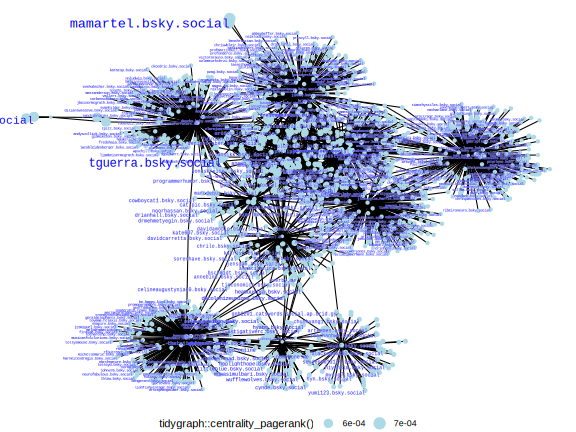

# Get Followers and Follows

You can retrieve a list of followers and those followed by a user through the `get_followers` and `get_follows` functions, respectively. This gives a glimpse of their social dynamics on the platform.


## Load the package


```r
library(atr)
```

## `get_followers`

Retrieve the followers of a specific account with `get_followers`:


```r
get_followers(actor = "benguinaudeau.bsky.social", limit = 200)  |>
  dplyr::glimpse()
#> Rows: 210
#> Columns: 11
#> $ did                <chr> "did:plc:cucpz3ev3knmel44tiixab3b", "did:plc:omhzuz24twosup5rv…
#> $ handle             <chr> "mamartel.bsky.social", "recsm.bsky.social", "barblibra.bsky.s…
#> $ display_name       <chr> "Marc-Antoine Martel", "The Research and Expertise Centre for …
#> $ description        <chr> "PhD candidate at Université de Montréal. Researching politica…
#> $ avatar             <chr> "https://cdn.bsky.app/img/avatar/plain/did:plc:cucpz3ev3knmel4…
#> $ indexed_at         <chr> "2023-12-17T20:47:57.882Z", "2023-12-14T14:23:33.089Z", "2023-…
#> $ viewer_muted       <lgl> FALSE, FALSE, FALSE, FALSE, FALSE, FALSE, FALSE, FALSE, FALSE,…
#> $ viewer_blocked_by  <lgl> FALSE, FALSE, FALSE, FALSE, FALSE, FALSE, FALSE, FALSE, FALSE,…
#> $ labels             <named list> <NULL>, <NULL>, <NULL>, <NULL>, <NULL>, <NULL>, <NULL>,…
#> $ viewer_following   <chr> NA, NA, NA, NA, NA, NA, NA, NA, NA, NA, NA, NA, NA, NA, NA, NA…
#> $ viewer_followed_by <chr> NA, NA, NA, NA, NA, NA, NA, NA, NA, NA, NA, NA, NA, NA, NA, NA…
```


## `get_follows`

Retrieve the accounts that are followed by a specific account with `get_follows`:


```r
atr:::get_follows(actor = "benguinaudeau.bsky.social", limit = 200)  |>
  dplyr::glimpse()
#> Rows: 171
#> Columns: 11
#> $ did                <chr> "did:plc:cucpz3ev3knmel44tiixab3b", "did:plc:omhzuz24twosup5rv…
#> $ handle             <chr> "mamartel.bsky.social", "recsm.bsky.social", "barblibra.bsky.s…
#> $ display_name       <chr> "Marc-Antoine Martel", "The Research and Expertise Centre for …
#> $ description        <chr> "PhD candidate at Université de Montréal. Researching politica…
#> $ avatar             <chr> "https://cdn.bsky.app/img/avatar/plain/did:plc:cucpz3ev3knmel4…
#> $ indexed_at         <chr> "2023-12-17T20:47:57.882Z", "2023-12-14T14:23:33.089Z", "2023-…
#> $ viewer_muted       <lgl> FALSE, FALSE, FALSE, FALSE, FALSE, FALSE, FALSE, FALSE, FALSE,…
#> $ viewer_blocked_by  <lgl> FALSE, FALSE, FALSE, FALSE, FALSE, FALSE, FALSE, FALSE, FALSE,…
#> $ viewer_following   <chr> NA, NA, NA, NA, NA, NA, NA, NA, NA, "at://did:plc:ntd53albt5ff…
#> $ viewer_followed_by <chr> NA, NA, NA, NA, NA, NA, NA, NA, NA, NA, NA, NA, NA, NA, "at://…
#> $ labels             <named list> <NULL>, <NULL>, <NULL>, <NULL>, <NULL>, <NULL>, <NULL>,…
```

You'll notice each follower/following has a description (i.e. their bio). It's a nifty way to get to know a bit about them at a glance!


## Follower Network Visualization

This section guides you through the process of visualizing a follower network for a given user on Blue Sky. The primary focus is on the interconnected relationships among followers.

The first step is to load some additional packages. Then we get the followers for the main user we are interested in. We will then delve deeper and fetch the followers for each of these followers.


```r
library(ggplot2)
library(dplyr)
library(purrr)
library(tidyr)
library(igraph)
library(ggraph)
library(tidygraph)

# Retrieve the followers for the main user
some_followers <- get_followers(actor = "benguinaudeau.bsky.social", limit = 10)$handle

# For each follower, retrieve their own set of followers.
# This provides a nested view of relationships.
followers_of_followers <- some_followers |>
  purrr::map_dfr(~{
    get_followers(actor = .x, limit = 200) |>
    mutate(from = .x)
  }) |>
  dplyr::rename(to = handle) |>
  dplyr::select(from, to) %>% 
  dplyr::add_count(to, name = "n_to") %>% 
  dplyr::add_count(from, name = "n_from") %>% 
  dplyr::filter(n_to > 1 | n_from > 1) %>% 
  dplyr::select(-n_to:-n_from)
```


## Building and Visualizing the Follower Network


```r
# Construct the network graph and plot
graph <- igraph::graph_from_data_frame(followers_of_followers, directed = TRUE)

# Use ggraph to visualize the network.
ggraph::ggraph(graph, layout = 'fr') +
  ggraph::geom_edge_link() +
  ggraph::geom_node_point(aes(size = tidygraph::centrality_pagerank()), color = "lightblue") +
  ggraph::geom_node_text(aes(label = name, size = tidygraph::centrality_pagerank(), family = "mono", fontface = "bold"), 
                   vjust = 1, hjust = 1, check_overlap = T, color = "white", show.legend = F) +
  ggraph::geom_node_text(aes(label = name, size = tidygraph::centrality_pagerank(), family = "mono"), 
                   vjust = 1, hjust = 1, check_overlap = T, color = "blue", show.legend = F) +
  ggplot2::theme_void() +
  ggplot2::theme(legend.position = "bottom")
```

<div class="figure">

<p class="caption">Follower Network</p>
</div>


## Find people to follow

You can use a similar approach to find new people you might want to follow.
First get all the people you already follow by quering your own account:


```r
my_follows <- get_follows(actor = "jbgruber.bsky.social",
                              limit = 10)$handle # limit only for demonstration

# For each account you follow, retrieve who they follow.
follows_of_follows <- my_follows |>
  purrr::map_dfr(~{
    get_followers(actor = .x, limit = 100) |>
      mutate(from = .x)
  })

# Now we can check which accounts are popular among the people you already follow
follows_of_follows |>
  dplyr::filter(!handle %in% my_follows) |> # exclude accounts you already follow
  dplyr::count(display_name, handle, sort = TRUE)
#> # A tibble: 721 × 3
#>    display_name               handle                          n
#>    <chr>                      <chr>                       <int>
#>  1 "Elizabeth (Bit) Meehan"   elizabethbitmeehan.com         12
#>  2 "Johannes B. Gruber"       jbgruber.bsky.social            9
#>  3 "Andy"                     andy2chris.bsky.social          6
#>  4 "Jen Mercieca "            jenmercieca.bsky.social         6
#>  5 "Shaily Patel"             vox-magica.bsky.social          6
#>  6 "Tommy"                    tommyg.bsky.social              6
#>  7  <NA>                      rps1227.bsky.social             6
#>  8 "Fulltime HTML Programmer" programmerhumor.bsky.social     5
#>  9 "OThingstodo"              othingstodo.bsky.social         5
#> 10 "Michael Friendly"         datavisfriendly.bsky.social     4
#> # ℹ 711 more rows
```

The original account shows up in this overview, as do accounts that were excluded because of the limit set to do the demonstration.

But all of these accounts look interesting!

# Likes and Reposts

You can also retrieve the accounts that liked or reposted your skeets.

## Who liked your skeets?

Want to create like networks? The `get_likes` function allows you to extract information about users who liked a specific post. By simply providing the post's URL, you can get a list of users who expressed their appreciation for the content.


```r
get_likes("https://bsky.app/profile/ryanlcooper.com/post/3kb42gayda52t")  |>
  dplyr::glimpse()
#> Rows: 25
#> Columns: 5
#> $ created_at   <dttm> 2023-11-15 11:54:29, 2023-11-08 13:21:46, 2023-11-07 14:36:38, 2023…
#> $ indexed_at   <dttm> 2023-11-15 11:54:29, 2023-11-08 13:21:49, 2023-11-07 14:36:41, 2023…
#> $ actor_handle <chr> "giw.bsky.social", "tillyx.bsky.social", "bighairyjack.bsky.social",…
#> $ actor_name   <chr> "Gareth Illmann-Walker", "Tilly", "Jack Vaughn", NA, "Grahms & List …
#> $ actor_data   <list> ["did:plc:rkx7ioruvfkr7ure6epdmqis", "giw.bsky.social", "Gareth Ill…
```

## Who reposted your skeets?

Want to create repost networks? Reposts (or reskeets), akin to retweets on platforms like Twitter, amplify the reach of content by sharing it with a wider audience.

The `get_reposts` function is designed to retrieve information about users who reposted a specific piece of content.


```r
get_reposts(post_url = "https://bsky.app/profile/ryanlcooper.com/post/3kb42gayda52t")  |>
  dplyr::glimpse()
#> Rows: 35
#> Columns: 9
#> $ did              <chr> "did:plc:rkx7ioruvfkr7ure6epdmqis", "did:plc:s3or3peikxebl2moku3…
#> $ handle           <chr> "giw.bsky.social", "lawless523.bsky.social", "laikax.bsky.social…
#> $ displayName      <chr> "Gareth Illmann-Walker", "lawless", "Grahms & List ... Sometimes…
#> $ description      <chr> "YamYam, White Hat open source geek old enough to have used a ZX…
#> $ avatar           <chr> "https://cdn.bsky.app/img/avatar/plain/did:plc:rkx7ioruvfkr7ure6…
#> $ indexedAt        <chr> "2023-11-08T08:02:57.224Z", "2023-07-11T00:52:25.878Z", "2023-10…
#> $ viewer_muted     <lgl> FALSE, FALSE, FALSE, FALSE, FALSE, FALSE, FALSE, FALSE, FALSE, F…
#> $ viewer_blockedBy <lgl> FALSE, FALSE, FALSE, FALSE, FALSE, FALSE, FALSE, FALSE, FALSE, F…
#> $ labels           <named list> <NULL>, <NULL>, <NULL>, <NULL>, <NULL>, <NULL>, <NULL>, "…
```


